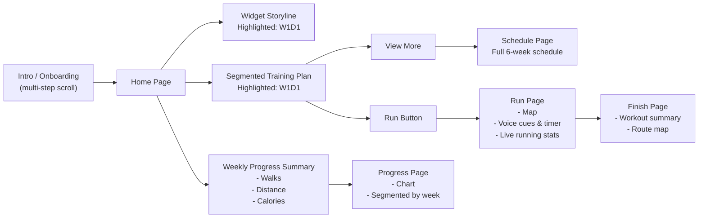

## Design

Final screens from the Figma file, covering onboarding through the first completed run.

  
  
  
  
  
  

## App Flow

The flow below maps every screen a first-time user passes through, from onboarding to their first completed run, plus the two return loops (widget and weekly progress) that keep them coming back.

### Screen-by-screen breakdown

**1. Intro / Onboarding**
A multi-step, scrollable questionnaire that personalizes the training plan before the user ever sees the home screen:
- Running goal — what the user wants to achieve (e.g. finish a first 5K)
- Current activity level — how often they already exercise
- Basic biometrics — gender, height, weight (optional)
- Weekly commitment — which days the user can realistically run (3 days/week is the recommended default)
- HealthKit permission request — asks to sync health and activity data

**2. Home Page**
The central hub. From here the user branches into three destinations: the widget storyline, their segmented training plan, and their weekly progress summary.

**3. Widget Storyline**
A home-screen widget that visualizes training progress as an ongoing story (the capybara/castle narrative), always highlighting the current session — e.g. Week 1, Day 1 (W1D1) — to nudge the user back into the app.

**4. Segmented Training Plan**
The core plan view, broken into digestible pieces instead of one long list, with the current session (W1D1) highlighted. Two actions branch from here:
- **View More →** opens the **Schedule Page**, showing the full 6-week training schedule.
- **Run →** starts the **Run Page**, which shows the live map, pace/interval voice cues with a timer, and real-time running stats. On completion it hands off to the **Finish Page**, which shows the workout summary and the recorded route on the map.

**5. Weekly Progress Summary**
A rollup shown from the Home Page covering walks, distance, and calories for the week. Tapping into it opens the **Progress Page**, with a chart view segmented per week so the user can see improvement over time.

## Deciding the Guiding Question

We spent the first week mapping out why people run at all, sorting questions into physical (preparation, technique, what makes runners stop) and mental (the deeper value of running, expectations, motivation) buckets — plus a few uncategorized ones, like why running stays inaccessible despite being one of the easiest sports to start. That mapping narrowed us down to one initial challenge.

### Initial Challenge
Help people prepare for various types of running

### Guiding Questions & Why They Matter
- **Why do some people run while others don't?** Running is accessible, but the barriers are personal (no motivation, a bad past experience, another sport they prefer) or environmental (unsafe surroundings, no community nearby) — rarely about difficulty.
- **What are the real limitations?** Injuries are the obvious physical blocker; the mental ones are subtler — not knowing where to start, stereotypes ("it's only for serious athletes"), and misinformation about how running actually works.
- **What's the value, and what makes people stop?** Runners gain self-knowledge — their physical limits, mental resilience — plus clarity and community. But a busy life, lost motivation, or injury derails that before it becomes a habit.
- **Why does preparation matter?** Most people underestimate it, and skipping it is what turns a good intention into a stalled one.

## User Persona

As a beginner runner, I want to run once a week, so that I will be mentally confident and physically capable to run my 1st 5K

### Brief User Persona
William "The Procrastinating Jogger"

"I've always wanted to build a consistent running habit, however my laziness, a lot of times, overcome my ambitions..."

### Opportunity Storyboard
William is a full-time employee working a busy 9-to-5. Between early commutes and late arrivals, he's often too exhausted for physical activity and ends up doomscrolling instead. He loves running but struggles with inconsistency — he only runs on weekends, lets procrastination win, and feels discouraged by his slow progress.

He wants to fix this with a structured training plan: run at least twice a week, use the right gear, and reach his body goals through better rest and nutrition. But he can't find a program that fits his 9-5 schedule, and he has no proper tracker to keep him consistent — the tools out there are too restrictive and lack a simple, organized system for building the habit.

  🏃
  
When struggling with his procrastination and exhaustion, William The Procrastinating Jogger wants to build a consistent running habit and reach his first 5K. Existing training programs do offer structured training plans but they are too restrictive for his limited free time and lack an easy to use tracking system to help him stay consistent.

### Solution Storyboard
#### **What is your magic solution?**

A beginner friendly guided training to reach their first 5k.

Uses: 
- ***C25K*** 6-week Schedule Program
- Run & Walk ***Tracker***
- Widgets for Progress Tracking

Allows William to:
- Track his run progress using per week schedule
- Flexibly following run schedule according his own schedule.
- Engaged to the widget's storyline

#### **How does your solution address their pains /needs?**

- Too confused to make a sustainable and progressive training plan -> ***achievable progress/challenge bubbles***

- Does not know when to change pace/interval training -> ***audio cue to indicate change in pace***

- Lacking motivation & discipline to run -> ***tracks progression & show stats of user improvement over time***

- Feeling overwhelmed -> ***segmented view of the training plan***

- Limited time -> ***lighter accountability system & freedom in choosing schedules***

#### **What would a happy ending look like?**

- William ***feels ready*** for his 5K. 

- He can ***deny his procrastination and be consistent*** by doing smaller steps to reach his goal.

- He has ***fit body and well-trained endurance***.

- He ***doesn't feel overwhelmed and intimidated*** by the plan and schedule given to him.

  🏃
  
Our Solutions uses HealthKit, CoreMotion, WidgetKit to tracking his run performance progress by providing him a guided training and flexibility , 
so that procrastinated runners like William can tracks progression with stats of user overtime, and doesn't feel overwhelmed by complicated programs. 

