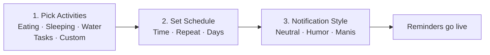
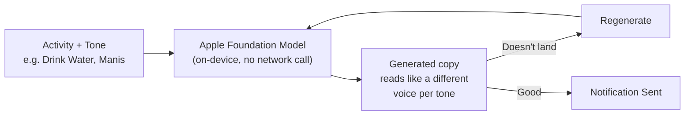

## Design — final screens from the Figma file, covering the 3-step onboarding

Pick activities, set a schedule, then choose how each reminder should sound.

  
  
  

## App Flow — one decision per screen, from activity list to notification tone

**Pick activities** — daily things to be reminded about, or a custom one. **Set schedule** — one or more times per activity, repeat daily or on specific days. **Notification style** — each activity gets its own tone, and the reminder copy is generated to match (e.g. *"Hai sayang, waktunya makan ya! Tubuhmu butuh energi hari ini 🥰"* for Manis).

## Tech — on-device Foundation Model generates the reminder copy per tone

Copy isn't a static template swapping a word or two — it's generated per activity and tone, so "Manis" and "Humor" genuinely read like different voices. Running it on-device means no round-trip and no user data leaving the phone for something as small as a reminder string.
