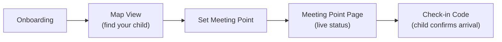
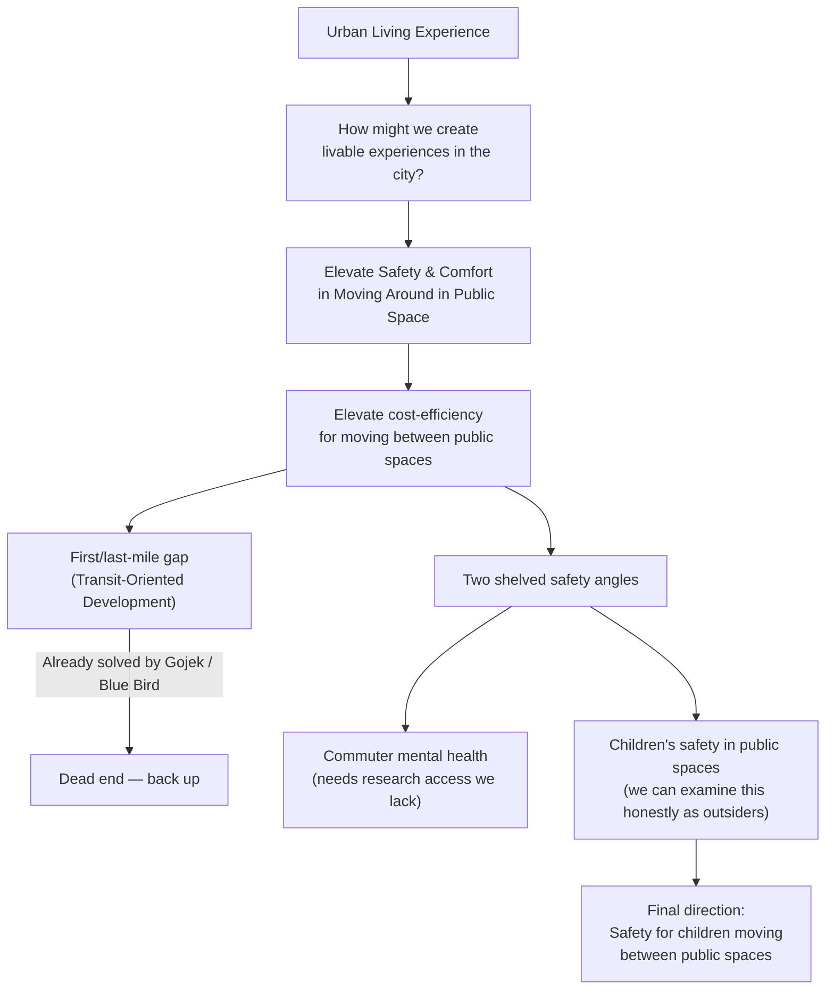
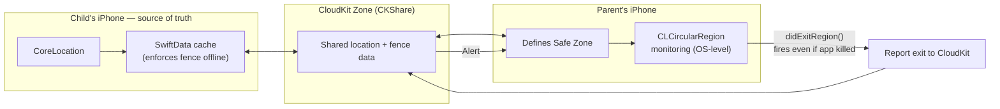

## Design — final screens from the Figma file, covering onboarding through a completed child check-in

Onboard, find your child on the map, set a meeting point, then confirm arrival with a check-in code.

<div class="design-grid">
  
  
  
  
  
  
</div>

## App Flow — from onboarding to a confirmed child check-in



## Process — narrowing "Urban Living Experience" into child safety in public spaces

We started from one broad prompt and narrowed it down over several passes, backtracking once when a promising lead turned out to be already solved:



Mapping the stakeholders around urban mobility — people, government, Gojek, JNE/Lalamove couriers, roads and sidewalks, MRT/LRT/Transjakarta — sharpened "comfort" into two concrete levers, fast arrival and low cost. Chasing cost-efficiency led to the first/last-mile gap, but that was already solved by Gojek and Blue Bird — a dead end that sent us back to two shelved safety angles. Children's safety won because we could examine it honestly as outsiders; the commuter angle needed research access we didn't have.

Observing recreation spots like Scientia Park and Taman Mini Indonesia Indah (TMII) confirmed the direction: most public spaces in Indonesia aren't safe enough for parents to let kids roam freely. Which raised the question that shaped everything after — **how can we assure parents that their children can move safely between places?**

## Persona — Mama Zizi, torn between her job and her child's safety

Our persona is a busy working mom, Mama Zizi:

> "I want to make sure my children are safe, but I have minimal time and presence due to my work."

### Context

**What's her day-to-day like?**
- Has responsibilities at work
- Her child likes to go out and explore
- Needs to make sure her child is safe even when he's not by her side

### Motivation

**What does she want/need?**
- Safety for her children
- Time for work
- To let her child explore, but still under her control

**Why does she want/need it?**
- Her children's safety is important to her
- Public spaces in Indonesia aren't trusted for security and often aren't safe
- Lack of self-awareness in her child

### Behaviours and Pains

**What does she do to get what she wants/needs?**
- Trusts the environment when letting her child go (delegating)
- Pays more for reassurance
- Accompanies her child in person

**What are her struggles? What is she trying to avoid?**
- Afraid her child might get lost or wander off.
- Afraid her child might be harassed or abused.
- Afraid her child might fall in with the wrong crowd.
- Worried that if she has to look after her child, she won't be able to keep up with her work.
- Her child rarely checks in once he's having fun while out and about.

## The Problem — every workaround costs Mama Zizi money, time, or her child's independence

Mama Zizi wants her child to have a childhood that includes Scientia Park and TMII on his own terms — not always trailing an adult. Today that isn't a real option. Indonesian public spaces aren't built with a child's safety in mind: no reliable way to confirm a child arrived, is where he said he'd be, or is safe in the gap between two places. No infrastructure for it, no visibility into it.

So parents like Mama Zizi are left with three costly workarounds, and none of them work:

- **Escort the child in person** — safe, but it costs the time she needs for work.
- **Pay for extra supervision** — a driver, a helper — safe, but it costs money she'd rather not spend.
- **Keep the child close** — cheap and easy, but it costs the child the independence and exploration he wants.

Every option trades away something she can't afford to lose. She isn't choosing between "safe" and "independent" for her child — she's choosing between her job and his safety, because the public spaces around her offer no third way.

That's the gap `Scouters` set out to close: let children move independently between public spaces, without asking a parent to give up safety, time, or money to allow it.

## Value Proposition Statement — closed-loop communication instead of one-off reassurance

For parents who need reassurance about their children's safety while roaming recreation areas, Scouters offers a more personalized way to get quick information and communicate in a closed loop — community-parents, parents-parents, children-parents, and recreation-area-parents.

## Value Proposition Canvas — mapping how Scouters relieves Mama Zizi's pains and creates gains against what the product delivers

<div class="vpc-columns">
  <div class="vpc-col">
    <p class="vpc-col-label">Value Map — Scouters</p>
    <div class="vpc-card vpc-card--neutral">
      <h4>Products &amp; Services</h4>
      <ul>
        <li>Real-time parent-child location sharing</li>
        <li>Safe-zone (geofence) setup per recreation area</li>
        <li>One-tap check-in from the child's device</li>
        <li>Closed-loop alerts across community, parents, and recreation-area staff</li>
      </ul>
    </div>
    <div class="vpc-card vpc-card--gain">
      <h4>Gain Creators</h4>
      <ul>
        <li>Live status replaces constant phone calls</li>
        <li>Child can roam freely within a boundary the parent set</li>
        <li>Trusted community members can flag something off before it becomes a problem</li>
        <li>Parent stays focused on work instead of worrying</li>
      </ul>
    </div>
    <div class="vpc-card vpc-card--pain">
      <h4>Pain Relievers</h4>
      <ul>
        <li>Removes the need to personally escort or pay for extra supervision</li>
        <li>Automatic check-in nudges, so the child doesn't have to remember</li>
        <li>Immediate alert if the child leaves the safe zone or goes quiet</li>
        <li>Direct line to nearby trusted parents and recreation-area staff, not just after the fact</li>
      </ul>
    </div>
  </div>
  <div class="vpc-col">
    <p class="vpc-col-label">Customer Profile — Mama Zizi</p>
    <div class="vpc-card vpc-card--gain">
      <h4>Gains</h4>
      <ul>
        <li>Peace of mind without needing to be physically present</li>
        <li>Keeps her income and career on track</li>
        <li>Child gets real independence, inside a boundary she trusts</li>
        <li>One less thing competing for her limited time</li>
      </ul>
    </div>
    <div class="vpc-card vpc-card--neutral">
      <h4>Customer Job(s)</h4>
      <ul>
        <li>Know her child is safe while she's at work</li>
        <li>Let her child explore public spaces on his own</li>
        <li>Reach someone trustworthy fast if something feels wrong</li>
      </ul>
    </div>
    <div class="vpc-card vpc-card--pain">
      <h4>Pains</h4>
      <ul>
        <li>Afraid her child might get lost or wander off</li>
        <li>Afraid her child might be harassed or abused</li>
        <li>Afraid her child might fall in with the wrong crowd</li>
        <li>Worried that if she has to look after her child, she won't keep up with work</li>
        <li>Her child rarely checks in once he's having fun while out and about</li>
      </ul>
    </div>
  </div>
</div>

## Tech — two paired devices sharing one CloudKit zone, geofencing handled by the OS

### Architecture

Scouters runs on two paired devices — child and parent — sharing one CloudKit zone through `CKShare`. No custom backend, no server to stand up in a one-week build. The child's phone is the source of truth: it owns the location data and uploads to it; the parent's phone reads the share and defines safe zones.



| Layer | Choice | Why |
|---|---|---|
| Location | `CoreLocation` | Native, battery-aware, works offline |
| Sync | `CloudKit` (`CKShare`) | Zero backend, built-in access control between two Apple IDs |
| Local cache | `SwiftData` | Geofence still enforces if the child's connection drops |
| Geofencing | `CLCircularRegion` monitoring | OS-level, wakes the app even if killed |
| Background | `BackgroundTasks` | Periodic resync of fence definitions to the parent |

### Key insight

The naive version of this — poll the child's coordinates every few seconds and check them against the fence in code — is the easiest thing to build and the wrong thing to ship. A `CLLocationManager` fix isn't instantaneous; there's a real gap, often several seconds, between where the child actually is and what the last computed fix says. Poll on that assumption and you'll either miss an exit or fire a false alarm the moment the fix lags behind a fast-moving kid.

The fix was to stop treating geofencing as something *my* code checks, and hand it to the OS instead:

```swift
func startMonitoring(fence: SafeZone) {
    let center = CLLocationCoordinate2D(
        latitude: fence.centerLatitude,
        longitude: fence.centerLongitude
    )
    let region = CLCircularRegion(center: center, radius: fence.radiusMeters, identifier: fence.id)
    region.notifyOnExit = true
    locationManager.startMonitoring(for: region)
}

// iOS calls this directly on boundary crossing — no polling loop, no lag budget to manage
func locationManager(_ manager: CLLocationManager, didExitRegion region: CLRegion) {
    Task {
        try? await cloudKit.reportExit(zoneID: region.identifier)
    }
}
```

`startMonitoring(for:)` is hardware-backed — it survives app termination, costs a fraction of the battery a polling timer would, and removes an entire class of bugs I would've otherwise had to hand-roll (debouncing, staleness checks, "close enough" counts for fence edges).

### Why CloudKit over a custom backend

With a week on the clock, a REST API plus auth plus a database was time I didn't have. `CKShare` gave me parent-child access control for free — the child shares a zone, the parent accepts the invite, and CloudKit handles who can read and write what. The trade-off is real: it only works within the Apple ecosystem, and debugging share-acceptance flows ate more of the week than I expected. For a challenge scoped to one persona on one platform, the trade was worth making. If Scouters became a real product, the sharing model is the first thing I'd reconsider — cross-platform families need more than shared Apple ID trust between each other.

## App Intents — Nudge and Set Meeting Point as Siri Shortcuts

A parent mid-errand shouldn't have to open the app to check in on their kid. Both core parent actions — nudging a child and setting a meeting point — are exposed as `AppIntent`s, so "Hey Siri, nudge my child with Scouters" works from the lock screen, no app launch required.

```swift
// SendNudgeIntent.swift — runs without the app in the foreground
struct SendNudgeIntent: AppIntent {
    static var title: LocalizedStringResource = "Nudge My Child"
    static var openAppWhenRun: Bool = false

    func perform() async throws -> some IntentResult & ProvidesDialog {
        guard let childId = await AppContainer.pairedChildId else {
            throw NotPairedError()
        }
        await NudgeSignalService().sendNudge(to: childId)
        return .result(dialog: "Nudge sent.")
    }
}
```

`openAppWhenRun = false` is the deliberate part — reading the paired child from `AppContainer.pairedChildId` instead of a live `ParentViewModel` is what makes that possible, since a Siri invocation may run with no view hierarchy alive at all.

Setting a meeting point needed a picker, not just a phrase, so it's backed by an `AppEntity`:

```swift
// MeetingPointEntity.swift — wraps MeetingPoint so Shortcuts can list it
struct MeetingPointEntity: AppEntity {
    let id: String
    let name: String
    let coordinate: CLLocationCoordinate2D

    static var defaultQuery = MeetingPointEntityQuery()

    var displayRepresentation: DisplayRepresentation {
        DisplayRepresentation(title: "\(name)")
    }
}

struct MeetingPointEntityQuery: EntityQuery {
    func suggestedEntities() async throws -> [MeetingPointEntity] {
        MeetingPointProvider.all.map(MeetingPointEntity.init)
    }
}
```

`SendMeetingPointIntent` takes a `@Parameter var point: MeetingPointEntity`, so Siri and the Shortcuts app can present the same named-location list the in-app map uses, then resolve straight to a `MeetingPoint` and write it to the child's CloudKit zone. It only writes the fields `ChildViewModel` listens for — the local map decoration (`activeMeetingPoint` pin, `parentWalkRoute`) that the in-app flow does stays out, since those need a live view to render into.

Both intents surface through `ScoutersShortcuts: AppShortcutsProvider`, which is what makes them discoverable in Siri and the Shortcuts app without the user ever having to manually build an automation.
