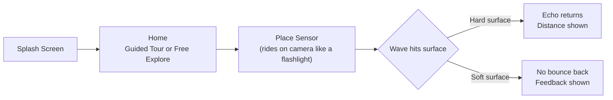
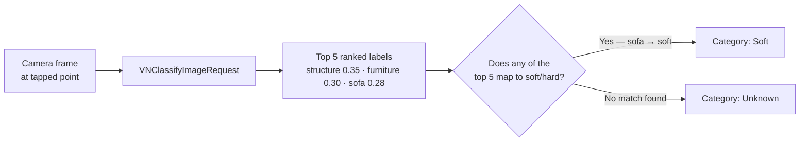

## Design — final screens from the Figma file, covering splash through the wave-feedback flow

Splash, choose a guided tour or free explore, aim and place the sensor, then watch the wave bounce back — or fail to, off a soft surface.

<div class="design-grid">
  
  
  
  
  
  
  
  
</div>

## App Flow — from splash to seeing whether the wave bounces back



## Initial Challenge — a broad AR brief narrowed to visualizing ultrasonic sensors for CK Education's robotics class

This project started with three emerging-tech tracks on the table — AI/ML, IoT, and AR — and our group picked AR. The open brief was broad: elevate the experience of understanding abstract concepts. Broad enough to build almost anything, which meant the first real work wasn't writing code, it was finding one concrete, real case where "abstract concept" had a name and a face.

We anchored on [CK Education](https://www.ckeducation.co.id), a STEAM-focused education company running project-based robotics classes for kids. Their own teaching notes handed us the refined challenge statement almost verbatim: **help students visualize how sensors receive signals in robotics with AR.** Everything downstream — the persona, the wave simulation, the classroom flow — traces back to one scene in their case notes.

## User Persona — Aldo, 11, comfortable with robots but new to seeing a sensor's signal

Aldo, 11, in CK Education's Robotics Class (ages 10–17, weekly 2-hour sessions). He's assembled a handful of LEGO-based robots before and knows sensors exist as parts you snap onto a build. He is not new to robotics — he's new to *sensors specifically*. He has a short attention span and is genuinely curious about how things work, but the class currently has no way to show him a sensor's signal in action — only a teacher's verbal explanation and a diagram on a whiteboard.

## Plan — an AR view that reveals the ultrasonic sensor's invisible sound wave in real time

Give Aldo an AR view where pointing his device at his own physical robot reveals the ultrasonic sensor's invisible sound wave — leaving, traveling, bouncing, returning — in real time, so he builds the same conceptual model an engineer has, not a memorized rule.

## Problem — "because it's programmed" is a hollow answer that hides the real mechanism

CK Education's own teaching notes documented the exact failure mode we were solving. A teacher explains that an ultrasonic sensor sends a sound wave and measures how long the echo takes to return. Later, she asks: "why does the robot stop before hitting the wall?" The typical answer: *"because it's programmed."* Technically correct, and completely hollow — the student understands the outcome, not the mechanism. That gap is invisible in the moment (the robot works fine) and only surfaces the next time a student is asked to reason about a sensor he's never really seen work.

## Opportunity — AR overlays the invisible sensor behavior onto the robot a student already built

Because CK Education already teaches robotics through hands-on, project-based assembly — kids build the physical robot themselves — the missing piece isn't motivation, it's visibility. The sensor's actual behavior happens at a frequency and speed nobody can see. AR is the one medium that can overlay that invisible process directly onto the real, physical robot a student already built and is already holding, instead of asking them to imagine it from a diagram. This is the window: the classroom format already assumes hands-on interaction, AR just needed to fill in the one sense (sight into the invisible) the format was missing.

## Challenges — technical, product, and execution problems the team hit

- **Technical — no LiDAR on the test device.** Our iPhone 17 test unit doesn't carry the Pro-only LiDAR sensor, which ruled out real-time dense scene reconstruction. We fell back to `ARWorldTrackingConfiguration` plane detection plus raycasting (`.existingPlaneGeometry` → `.estimatedPlane` fallback), and ran a dedicated feasibility POC before committing to the full build, specifically to confirm that a single tapped-point distance reading was reliable on non-Pro hardware. It was — the POC's only open question ("does this crash or misbehave on-device") closed clean.
- **Technical — simulating real sensor failure modes without a real sensor.** A real HC-SR04 fails to echo off soft, absorbent, or steeply angled surfaces — physics ARKit's raycast has no way to know about on its own. We built a tagged virtual-obstacle system to simulate those failure modes deliberately, then layered on-device [Vision](/blog/vision) classification (`VNClassifyImageRequest`) to guess material automatically instead of manual tagging. That surfaced a real bug: Vision's top-ranked guess for an actual sofa was `"structure"` — a generic architectural label, not a material one — which meant `.unknown` even when a specific, correctly-mapped label like `"sofa"` was sitting two ranks down. Fixed by walking the top 5 ranked candidates instead of trusting rank 1 blindly (more on this below).
- **Product — which solution direction actually fit a solo, time-boxed build.** We drafted three directions: a multi-sensor robot-reaction "game" (closest to the full classroom experience, but assumed a physical robot present at judging and carried the highest content burden), a single-sensor wave simulation, and a hybrid with a light challenge layer on top. CK Education's own case notes were, almost word for word, already a spec for the single-sensor direction — so we converged there instead of building toward the most ambitious option by default.
- **Product — the placement interaction didn't match how aiming actually works.** Our first pass had the student tap a flat surface to place the sensor, then "tilt" the already-placed object to test a different angle — a gesture that doesn't correspond to anything physical. We redesigned it so the sensor rides attached to the camera (like a flashlight) until the student taps *Place*, and testing a new surface means picking it back up and aiming again — not manipulating an object that's already been set down.
- **Execution — a 4-week window covering research through build.** With CK Education's source material, three drafted directions, a feasibility POC, and the actual SwiftUI/RealityKit build all inside four weeks, scope had to be cut deliberately and early: onboarding polish, a scoring layer, and multi-sensor support were explicitly deferred out of the POC so the core wave mechanic could be validated first.

---

## How I Built It — a feasibility POC before any wave-visualization code

### Approach

Feasibility came before features. Before writing any of the wave visualization, we scoped a standalone POC with one question: can ARKit reliably raycast a tapped point and report a distance, from first-person view, on a non-LiDAR device? Everything else — onboarding, the challenge layer, multi-sensor types — was explicitly out of scope for that POC. Only once the raycast path was confirmed working on-device did the full build start: SwiftUI hosting a `UIViewRepresentable` wrapper around a RealityKit `ARView`, with the sensor's ripple animation (solid rings out from the transmitter dome, dashed rings back to the receiver dome) built directly on top of the same raycast the POC validated. The full source is on GitHub: [refactor-ECS](https://github.com/storyofhis/refactor-ECS).

### The Key Insight

The material-detection layer taught me something the POC didn't: a working pipeline and a *correct* pipeline aren't the same thing. `VNClassifyImageRequest` was returning real, high-confidence labels — just not always the most *useful* one.



[Vision](/blog/vision)'s top guess for a real sofa was a generic label like `"structure"`, which doesn't exist in either the soft or hard lookup list, so the naive "just take the top result" approach silently fell back to `.unknown` even when a specific match was sitting a few ranks down.

```swift
// Services/MaterialDetection/MaterialVisionClassifier.swift — don't trust rank 1 blindly
private static let topNCandidates = 5

private func pickBestMatch(from observations: [VNClassificationObservation]) -> MaterialClassificationResult {
    for candidate in observations.prefix(Self.topNCandidates) {
        let result = mapToCategory(label: candidate.identifier, confidence: candidate.confidence)
        if result.category == .soft || result.category == .hard {
            return result
        }
    }
    let top = observations[0]
    return mapToCategory(label: top.identifier, confidence: top.confidence)
}
```

Walking the top 5 candidates instead of just rank 1 turned that real sofa from `.unknown` into `.soft` — the winning label (`"sofa"`, confidence 0.28) had a *lower* score than the two generic labels that beat it (`"structure"` 0.35, `"furniture"` 0.30). Rank and relevance turned out to be two different axes, and only one of them was something Vision sorted for me.

## Result — a challenge submission, not a live product, so the scorecard is what got validated

This shipped as a challenge submission, not a live product, so the honest scorecard is what got validated, not user-facing metrics:

| Question | Outcome |
|---|---|
| Does ARKit raycast reliably report distance on a non-LiDAR device? | Confirmed in a dedicated POC before the full build started |
| Does the wave visualization correctly originate from/return to the sensor's real transducer geometry? | Yes — resolved the transmitter/receiver dome positions directly from the 3D asset's hierarchy rather than the anchor's generic origin |
| Did the material-detection top-1 approach actually work? | No — caught via the "structure" bug, fixed with the top-5 ranked fallback above |

## What I'd Do Differently — validate with a real student earlier, compare directions faster

I'd get in front of an actual CK Education student earlier. Every decision here — the persona, the refined challenge statement, the three solution directions — was reasoned from the source case notes, never validated with a real 10–12-year-old holding the device. And I'd skip drafting three full solution directions before comparing them: the source material was close enough to a spec for the single-sensor direction that a faster point of comparison would have reached the same decision with less upfront writing.